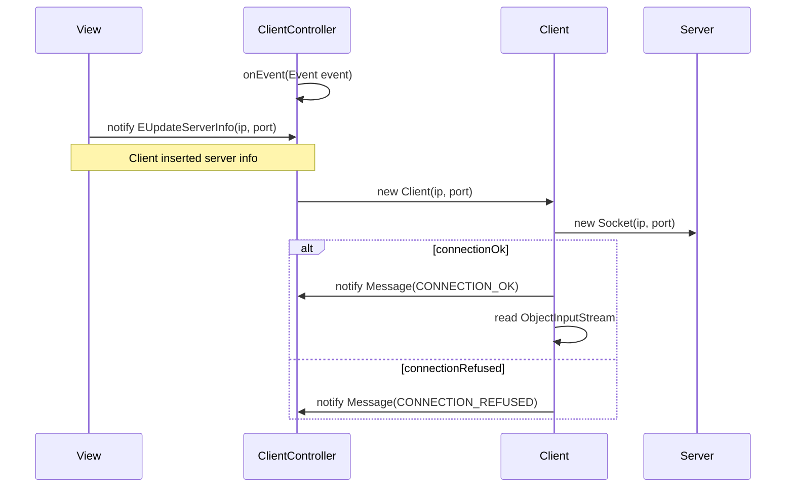

# Connection stage

```mermaid
sequenceDiagram
    participant View
    participant ClientController
    participant Client
    participant Server
    
    ClientController ->> ClientController: onEvent(Event event)
    
    View ->> ClientController: notify EUpdateServerInfo(ip, port)
    Note over View,ClientController: Client inserted server info
     
    ClientController ->> Client: new Client(ip, port)
    Client ->> Server: new Socket(ip, port)
    alt connectionOk
        Client ->> ClientController: notify Message(CONNECTION_OK)
        Client ->> Client: read ObjectInputStream
    else connectionRefused
        Client ->> ClientController: notify Message(CONNECTION_REFUSED)
    end

```