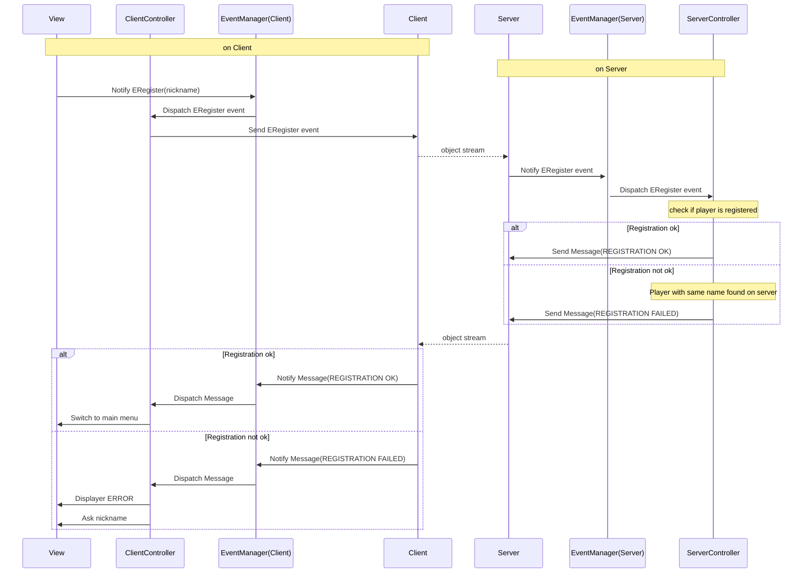

# Connection stage

```mermaid
sequenceDiagram
    participant View
    
    participant ClientController
    participant EventManager(Client)
    participant Client
    Note over View,Client: on Client

    participant Server
    participant EventManager(Server)
    participant ServerController
    Note over Server,ServerController: on Server
    
    View ->> EventManager(Client): Notify ERegister(nickname)
    
    EventManager(Client) ->> ClientController: Dispatch ERegister event
    ClientController ->> Client: Send ERegister event
       
    Client -->> Server: object stream
    
    Server ->>+ EventManager(Server): Notify ERegister event
    EventManager(Server) ->> ServerController: Dispatch ERegister event
    
    Note over ServerController: check if player is registered
    alt Registration ok
        ServerController ->> Server: Send Message(REGISTRATION OK)
    else Registration not ok
        Note over ServerController: Player with same name found on server
        ServerController ->> Server: Send Message(REGISTRATION FAILED)
    end
    
    Server -->> Client: object stream
    
    alt Registration ok
        Client ->> EventManager(Client): Notify Message(REGISTRATION OK)
        EventManager(Client) ->> ClientController: Dispatch Message
        ClientController ->> View: Switch to main menu
    else Registration not ok
        Client ->> EventManager(Client): Notify Message(REGISTRATION FAILED)
        EventManager(Client) ->> ClientController: Dispatch Message
        ClientController ->> View: Displayer ERROR
        ClientController ->> View: Ask nickname
    end

```